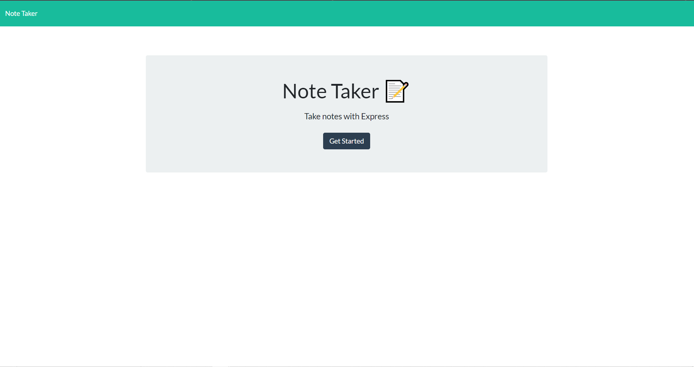

# Note Taker

This app is used to save notes as well as delete them when they are no longer needed.

## Description

-This app starts you off in a "main menu" with a button that takes you to the notes page. Once you get to the notes page you are able to write your new notes in the input boxes
-After you write your title and description, you are able to save using the button in the top right of the page. Once the note has been saved, it will display on the left side of the page. If you no longer want a specific note, you can delete it using the red ' x ' on the side of the note.

## Getting Started

### Dependencies

* Run npm i in the terminal to install dependencies

### Installing

* Clone repo and run npm start
* Or click on the heroku link to bypass cloning 

## Authors

Contributors names and contact info

Andrew Neuwirth

[@Neuy16](https://github.com/Neuy16)

## License

This project does not have a license

## Snippet

## Heroku

(https://neuy-notetaker.herokuapp.com/)